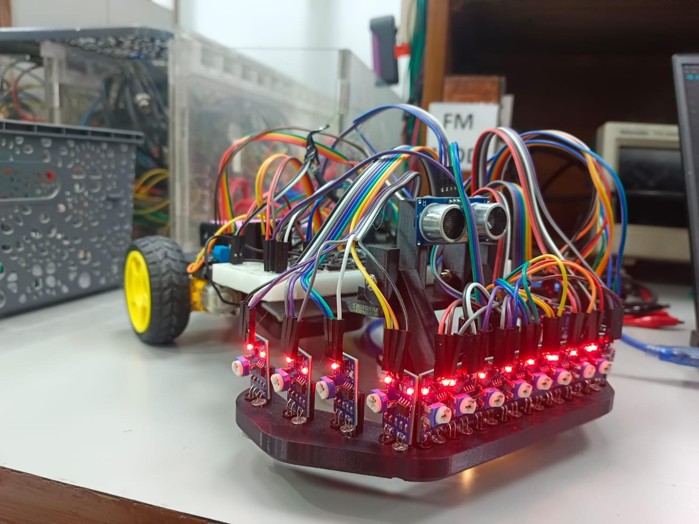

This robot detects and tracks a line (black,green and red) using sensors and dynamically adjusts its motion to stay on the path.
Currently it follows only black lines. In future, we will try to improvize it.

It demonstrates key concepts in:
1. Embedded systems
2. Robotics control
3. Sensor integration
4. Real-time decision making

Components Used-
- Microcontroller (Arduino or compatible)
- IR Sensors (for line detection)
- BO Motors
- Motor Driver (L298N / Shield)
- Chassis (custom CAD design)
- Wheels
- Battery pack
- Jumper wires
- Breadboard

The robot can clear 5 type of obstacles-
- Line Gaps
- Colour Change (In progress)
- Line split with colour based decision (In progress)
- Elevation changes and incline
- Obstacles and retracing (In progress)

